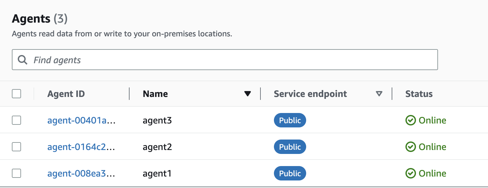
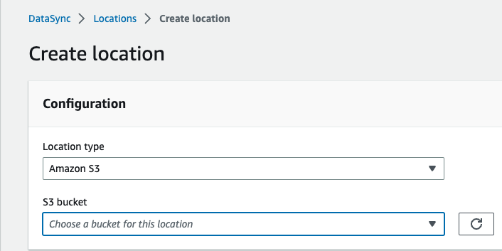
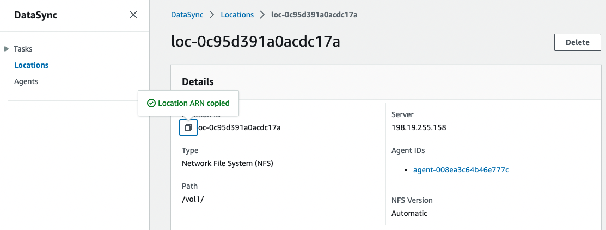
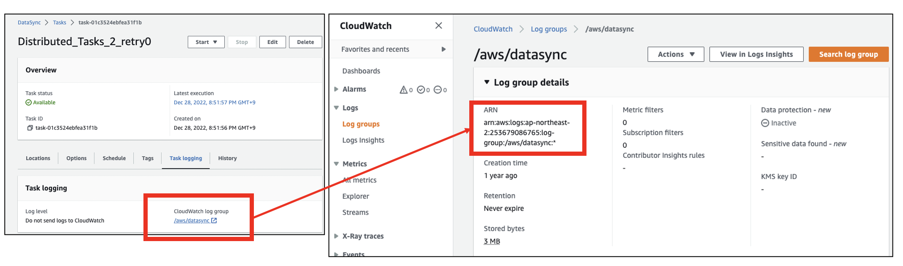
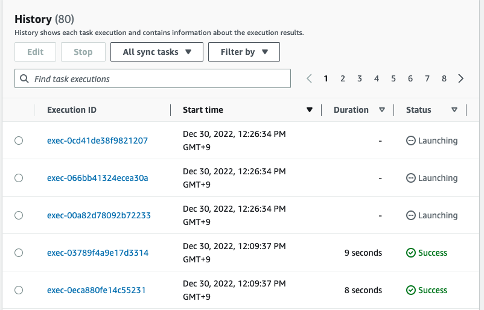
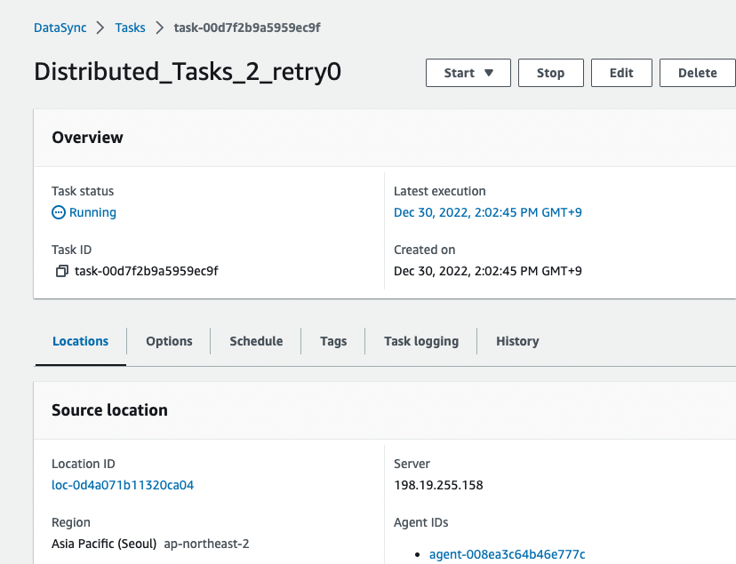

# aws datasync multi agent scheduler
*datasync multi agents scheduler* will enhance AWS DataSync feature to support multi agents for a task, and *datasync_agent_ha* will support fail-over feature when Task Execution failed. 

## Caveat
- Both *datasync_multi_agents_scheduler.py* and *datasync_agent_ha.py* will create new source locations and multiple tasks when everytime it runs.
- Theses scripts support only **NFS** source location. 

## Requirements
- boto3: >= 1.26
- python3
- Linux Virtual Machine which reside with DataSync Agent

## **datasync multi agents scheduler** 
### How **datasync multi agents scheduler** Works
1. find online DataSync agents
2. check directory list to transfer in source file(*source_file.manifest*)
3. search into directories to *max_depth*, and divide sub-directories with agent counts
4. map gathered directories to agents as even as possible
5. create source location for each online agents
6. create multiple tasks for parallel transfer
7. execute tasks
8. write arn of TaskExecution on *arn_file.txt*

### Usage
#### Preparation
##### Set *aws configure* on linux VM
```shell
$ aws configure

AWS Access Key ID [****************YYYY]:
AWS Secret Access Key [****************bbbb]:
Default region name [ap-northeast-2]:
Default output format [None]:
```

##### Creating Multiple DataSync Agents
You can install DataSync Agents on your hypervisor or on AWS Cloud. After installing DataSync Agents, you have to create Agent in AWS Web Console.


##### Creating Destination Location
Create destination location in AWS Web Console, it would be S3 or EFS or any other FSx Storage services. This location is the destination storage in AWS cloud. Later, you will use arn of Destination Location.


##### Input *source_file.manifest*
In linux VM, confirm nfs volume is mounted.
```
$ df /fsx

Filesystem                  1K-blocks     Used Available Use% Mounted on
svm-fsx.amazonaws.com:/vol1 972800000 97414848 875385152  11% /fsx
```

Look in mounting point, and select directories which you want to transfer.
```shell
$ ls -F /fsx

filegen*  filegen.go  files/  fs1/  fs2/  images/  org/  test1/
```

Specify your desired directory names in *source_file.manifest* file.
```shell
$ cat source_file.manifest

/files
/images
/org
/test1
```

if you want to transfer whole files below mounting point, just specify '/'. When mounting point is */fsx* and you wish every files of */fsx*, write '/' in *source_file.manifest*.

```shell
$ cat source_file.manifest

/
```

Preparation is Done, now you can run script.
#### Running *datasync_multi_agents_scheduler.py*
*run_ds_sche.sh* is a sample running script for *datasync_multi_agents_scheduler.py*.
```shell
$ cat run_ds_sche.sh

#!/bin/bash
python3 datasync_multi_agents_scheduler.py --task_name="Distributed_Tasks_" --nfs_server_name="198.10.10.10" --sub_dir="/vol1" --mount_path_dir="/fsx" --dest_loc="arn:aws:datasync:ap-northeast-2:XXXXXXXXXXXX:location/loc-042c919ab6996b437" --cloudwatch_arn="arn:aws:logs:ap-northeast-2:XXXXXXXXXXXX:log-group:/aws/datasync:*" --source_file="source_file.manifest"
```
**Explaining arguments**
- task_name: It is prefix of task name. When script runs, multiple tasks would generated, and this *task_name* will be uses as task name.  
- nfs_server_name: nfs server ip address
- sub_dir: directory name of NFS URI. For example, if nfs uri is nfs://198.10.10.10/vol1, */vol1* is the value of *sub_dir*, and 198.10.10.10 is the value of *nfs_server_name*
- mount_path_dir: nfs volume mounting point of linux VM.
- dest_loc: arn of destination location. you can find it on AWS Web Console.

- cloudwatch_arn: arn of CloudWatch which will store logs of DataSync. In order to get CloudWatch Arn, create sample DataSync Task, then you will know it easily.

- source_file: manifest file to write directori names which you want to transfer. For example, if you want to transfer all files of /fsx/images and /fsx/files, write "/images", "/files".

When you confirm all arguments, run *run_ds_sche.sh*
```shell
$ sh run_ds_sche.sh 

2022-12-30 03:09:35,815 - root - INFO - online agents: ['arn:aws:datasync:ap-northeast-2:XXXXXXXXXXXX:agent/agent-008ea3c64b46e777c', 'arn:aws:datasync:ap-northeast-2:XXXXXXXXXXXX:agent/agent-0164c2d96e855507b', 'arn:aws:datasync:ap-northeast-2:XXXXXXXXXXXX:agent/agent-00401a940b76e8d94']
2022-12-30 03:09:35,816 - root - INFO - Distribute directories to agents
2022-12-30 03:09:35,816 - root - INFO - agents: 3 
 task manifest: {'arn:aws:datasync:ap-northeast-2:XXXXXXXXXXXX:agent/agent-008ea3c64b46e777c': {'incl': ['/files', '/images'], 'excl': ''}, 'arn:aws:datasync:ap-northeast-2:XXXXXXXXXXXX:agent/agent-0164c2d96e855507b': {'incl': ['/org', '/test1'], 'excl': ''}, 'arn:aws:datasync:ap-northeast-2:XXXXXXXXXXXX:agent/agent-00401a940b76e8d94': {'incl': ['/files', '/images', '/org', '/test1'], 'excl': ['/files', '/images', '/org', '/test1']}}
2022-12-30 03:09:35,858 - root - INFO - source location is created: arn:aws:datasync:ap-northeast-2:XXXXXXXXXXXX:location/loc-04ddf05b55b0aa77a
2022-12-30 03:09:36,363 - root - INFO - task created: arn:aws:datasync:ap-northeast-2:XXXXXXXXXXXX:task/task-0f278e0ecfaf96e41
2022-12-30 03:09:36,469 - root - INFO - source location is created: arn:aws:datasync:ap-northeast-2:XXXXXXXXXXXX:location/loc-0d24a2d5ee2f5d713
2022-12-30 03:09:36,879 - root - INFO - task created: arn:aws:datasync:ap-northeast-2:XXXXXXXXXXXX:task/task-0845df4b4747d7b43
2022-12-30 03:09:36,921 - root - INFO - source location is created: arn:aws:datasync:ap-northeast-2:XXXXXXXXXXXX:location/loc-0348b7e5c67775f56
2022-12-30 03:09:37,279 - root - INFO - task created: arn:aws:datasync:ap-northeast-2:XXXXXXXXXXXX:task/task-073c564f12c08b66f
2022-12-30 03:09:37,488 - root - INFO - task executed: arn:aws:datasync:ap-northeast-2:XXXXXXXXXXXX:task/task-0f278e0ecfaf96e41/execution/exec-04a0830a463913759
2022-12-30 03:09:37,689 - root - INFO - task executed: arn:aws:datasync:ap-northeast-2:XXXXXXXXXXXX:task/task-0845df4b4747d7b43/execution/exec-0eca880fe14c55231
2022-12-30 03:09:37,917 - root - INFO - task executed: arn:aws:datasync:ap-northeast-2:XXXXXXXXXXXX:task/task-073c564f12c08b66f/execution/exec-03789f4a9e17d3314
```

In above log, 3 agents are detected, and 3 source locations and 3 tasks created, finally 3 tasks are executed successfully.
#### Monitoring
When *run_ds_sche.sh* run, log is written in *log/ds_ma_sche.log*. As well, you can monitor DataSync history in AWS Web Console.


Arn of executed tasks are stored in *arn_file.txt*. This file will be used to limit the task execution list for fail-over. 

-----
## **datasync agent ha**
**datasync agent ha** will support fail-over of agent when Task execution failed. Only failover happen once per each task to prevent from creating task infinitely.
### How **datasync agent ha** Works
1. find online DataSync agents
2. read arns of TaskExecution from *arn_file.txt*
3. check whether TaskExecution is failed or not
4. if TaskExecution failed,
4.1 create new destination location with available online agent
4.2 create new task, all parameters inherited from failed task information
4.3 execute retry-task, and add arn of retry-task into ignore list
5. if there is no failed task or re-try task executed, sleeping for *timeout_sec*

### Usage
#### Preparation
##### Checking Arns of Task Execution
In order to limit the monitoring scope, *datasync_agent_ha.py* looks in the *arn_file.txt*. Any of Task Execution is failed, *datasync_agent_ha.py* will recreate source location, task, and execute a re-try task.
```shell
$ cat arn_file.txt

arn:aws:datasync:ap-northeast-2:XXXXXXXXXXXX:task/task-0546adb0aeb579b5f/execution/exec-0ea2f514c737a13af
arn:aws:datasync:ap-northeast-2:XXXXXXXXXXXX:task/task-030bf268b8b8c25f2/execution/exec-08d3aa68059a7bf61
arn:aws:datasync:ap-northeast-2:XXXXXXXXXXXX:task/task-0793bacef8913351f/execution/exec-0f2b60ceafe37814b
```
#### Running *datasync_agent_ha.py*
*run_ds_ha.sh* is a sample running script for *datasync_agent_ha.py*.
```shell
$ cat run_ds_sche.sh

#!/bin/bash

python3 datasync_agent_ha.py --arn_file="arn_file.txt" --timeout_sec="500"
```

This script has only 2 arguments to run, other information is getting from failed-task.
**Explaining arguments**
- arn_file: arns of task execution, default is *arn_file.txt*
- timeout_sec: sleep time, default is 300

```shell
$ sh run_ds_ha.sh

2022-12-30 05:02:44,919 - root - INFO - online agents: ['arn:aws:datasync:ap-northeast-2:XXXXXXXXXXXX:agent/agent-008ea3c64b46e777c', 'arn:aws:datasync:ap-northeast-2:XXXXXXXXXXXX:agent/agent-0164c2d96e855507b', 'arn:aws:datasync:ap-northeast-2:XXXXXXXXXXXX:agent/agent-00401a940b76e8d94']
2022-12-30 05:02:44,919 - root - INFO - specified task execution: ['arn:aws:datasync:ap-northeast-2:XXXXXXXXXXXX:task/task-0546adb0aeb579b5f/execution/exec-0ea2f514c737a13af', 'arn:aws:datasync:ap-northeast-2:XXXXXXXXXXXX:task/task-030bf268b8b8c25f2/execution/exec-08d3aa68059a7bf61', 'arn:aws:datasync:ap-northeast-2:XXXXXXXXXXXX:task/task-0793bacef8913351f/execution/exec-0f2b60ceafe37814b']
2022-12-30 05:02:44,993 - root - INFO - failed task execution: ['arn:aws:datasync:ap-northeast-2:XXXXXXXXXXXX:task/task-0546adb0aeb579b5f/execution/exec-0ea2f514c737a13af']
2022-12-30 05:02:45,058 - root - INFO - failed task info: {'src_loc': 'arn:aws:datasync:ap-northeast-2:XXXXXXXXXXXX:location/loc-0c40e3c9a6fdc6919', 'dest_loc': 'arn:aws:datasync:ap-northeast-2:XXXXXXXXXXXX:location/loc-042c919ab6996b437', 'cloud_watch_arn': 'arn:aws:logs:ap-northeast-2:XXXXXXXXXXXX:log-group:/aws/datasync:*', 'task_name': 'Distributed_Tasks_2_retry', 'manifest': {'incl': '/test1|/fs1|/fs2', 'excl': ''}, 'subdir': '/vol1', 'server_name': '198.19.255.158'}
2022-12-30 05:02:45,104 - root - INFO - source location is created: arn:aws:datasync:ap-northeast-2:XXXXXXXXXXXX:location/loc-0d4a071b11320ca04
2022-12-30 05:02:45,484 - root - INFO - task created: arn:aws:datasync:ap-northeast-2:XXXXXXXXXXXX:task/task-00d7f2b9a5959ec9f
2022-12-30 05:02:45,484 - root - INFO - retry task created: arn:aws:datasync:ap-northeast-2:XXXXXXXXXXXX:task/task-00d7f2b9a5959ec9f
2022-12-30 05:02:45,673 - root - INFO - task executed: arn:aws:datasync:ap-northeast-2:XXXXXXXXXXXX:task/task-00d7f2b9a5959ec9f/execution/exec-0d512e3feb27d7ff7
2022-12-30 05:02:45,673 - root - INFO - retry task executed: arn:aws:datasync:ap-northeast-2:XXXXXXXXXXXX:task/task-00d7f2b9a5959ec9f/execution/exec-0d512e3feb27d7ff7
2022-12-30 05:02:45,674 - root - INFO - There is/are 1 retry task execution.....
2022-12-30 05:02:45,674 - root - INFO - sleeping 500 sec
```
#### Monitoring
Log is writing on *log/ds_ha.log*. As well, you can see re-tried task. 


